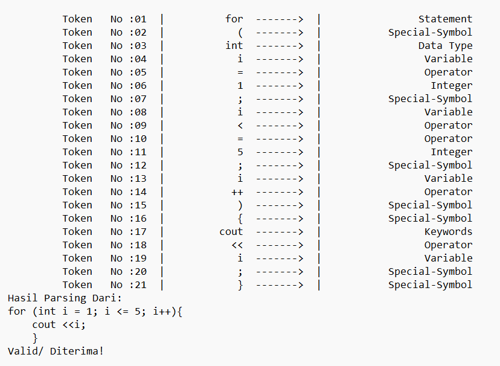

<h1 align ="center">Lexical Analyzer dan Parser untuk "for-loop C++".</h1>
<h3 align ="center">Tugas Besar Teori Bahasa & Automata</h3>

## Cara menjalankan program:
1. Clone menggunakan `git clone https://github.com/ditorifadli/tubes-tba-2023.git`
2. Pada folder yang sudah di clone, jalankan  `tubes-tba.exe`
3. Atau gunakan compiler C++ dan jalankan `tubes-tba.cpp`
4. Program siap dijalankan

## Cara memasukan inputan:
1. Setelah di run, akan muncul input:
2. Masukan file dengan format txt seperti `SourceCode.txt`
3. Lalu enter, kode berhasil dijalankan
4. Output dapat di lihat pada file `OutputFile.txt`

## Contoh isi dari SourceCode.txt:
```
for (int i = 1; i <= 5; i++){ 
    cout <<i; 
    }
```

## Output dari SourceCode.txt


